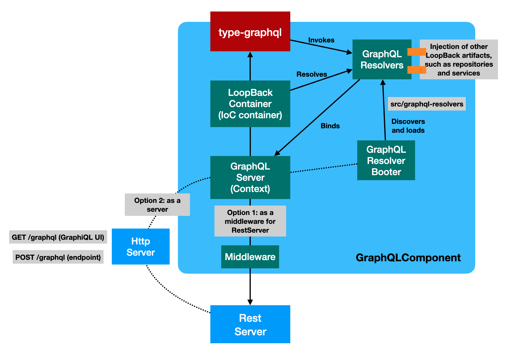
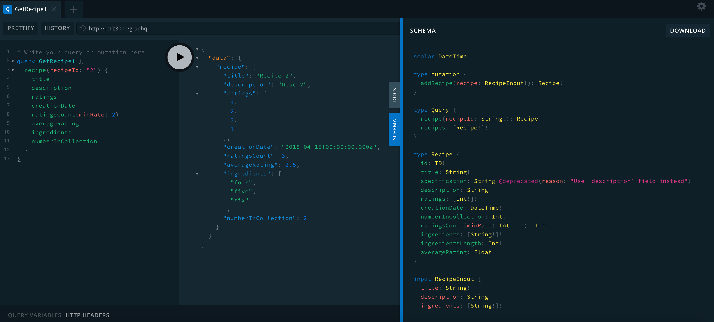

# @loopback/graphql

This module provides integration with [GraphQL](https://graphql.org/) using
[type-graphql](https://typegraphql.com/).



## Stability: ⚠️Experimental⚠️

> Experimental packages provide early access to advanced or experimental
> functionality to get community feedback. Such modules are published to npm
> using `0.x.y` versions. Their APIs and functionality may be subject to
> breaking changes in future releases.

## Installation

```sh
npm install --save @loopback/graphql
```

## Basic Use

```ts
export class MyApplication extends BootMixin(RestApplication) {
  constructor(config: ApplicationConfig) {
    super(config);
    this.projectRoot = __dirname;
    this.component(GraphQLComponent);
    this.configure(GraphQLBindings.GRAPHQL_SERVER).to({asMiddlewareOnly: true});
  }
}
```

## Configure GraphQLServer

This package can be used in two flavors:

- As a server for LoopBack applications

```ts
import {Application} from '@loopback/core';
import {GraphQLServer} from '@loopback/graphql';

const app = new Application();
const serverBinding = app.server(GraphQLServer);
app.configure(serverBinding.key).to({host: '127.0.0.1', port: 0});
server = await app.getServer(GraphQLServer);
// ...
await app.start();
```

- As a middleware for LoopBack REST applications

```ts
import {BootMixin} from '@loopback/boot';
import {RepositoryMixin} from '@loopback/repository';
import {RestApplication} from '@loopback/rest';
import {ApplicationConfig} from '@loopback/core';
import {GraphQLComponent, GraphQLBindings} from '@loopback/graphql';

export class GraphqlTestApplication extends BootMixin(
  RepositoryMixin(RestApplication),
) {
  constructor(options: ApplicationConfig = {}) {
    super(options);

    this.component(GraphQLComponent);
    const server = this.getSync(GraphQLBindings.GRAPHQL_SERVER);
    this.expressMiddleware('middleware.express.GraphQL', server.expressApp);
    this.configure(GraphQLBindings.GRAPHQL_SERVER).to({
      asMiddlewareOnly: true,
    });

    // ...

    // Customize @loopback/boot Booter Conventions here
    this.bootOptions = {
      graphqlResolvers: {
        // Customize ControllerBooter Conventions here
        dirs: ['graphql-resolvers'],
        extensions: ['.js'],
        nested: true,
      },
    };
  }
}
```

## Add a resolver

Please add `recipe-resolver.ts` to `src/graphql-resolvers`.

```ts
import {service} from '@loopback/core';
import {repository} from '@loopback/repository';
import {
  arg,
  fieldResolver,
  Int,
  mutation,
  query,
  resolver,
  root,
  ResolverInterface,
} from '@loopback/graphql';
import {RecipeInput} from '../graphql-types/recipe-input';
import {Recipe} from '../graphql-types/recipe-type';
import {RecipeRepository} from '../repositories';
import {RecipeService} from '../services/recipe.service';

@resolver(of => Recipe)
export class RecipeResolver implements ResolverInterface<Recipe> {
  constructor(
    // constructor injection of service
    @repository('RecipeRepository')
    private readonly recipeRepo: RecipeRepository,
    @service(RecipeService) private readonly recipeService: RecipeService,
  ) {}

  @query(returns => Recipe, {nullable: true})
  async recipe(@arg('recipeId') recipeId: string) {
    return this.recipeRepo.getOne(recipeId);
  }

  @query(returns => [Recipe])
  async recipes(): Promise<Recipe[]> {
    return this.recipeRepo.getAll();
  }

  @mutation(returns => Recipe)
  async addRecipe(@arg('recipe') recipe: RecipeInput): Promise<Recipe> {
    return this.recipeRepo.add(recipe);
  }

  @fieldResolver()
  async numberInCollection(@root() recipe: Recipe): Promise<number> {
    const index = await this.recipeRepo.findIndex(recipe);
    return index + 1;
  }

  @fieldResolver()
  ratingsCount(
    @root() recipe: Recipe,
    @arg('minRate', type => Int, {defaultValue: 0.0})
    minRate: number,
  ): number {
    return this.recipeService.ratingsCount(recipe, minRate);
  }
}
```

## Use LoopBack dependency injections in resolver classes

All of LoopBack decorators for dependency injection , such as `@inject`,
`@service`, `@repository`, and `@config`, can be used with resolver classes.

```ts
import {service} from '@loopback/core';

@resolver(of => Recipe)
export class RecipeResolver implements ResolverInterface<Recipe> {
  constructor(
    // constructor injection of service
    @repository('RecipeRepository')
    private readonly recipeRepo: RecipeRepository,
    @service(RecipeService) private readonly recipeService: RecipeService,
  ) {}
}
```

## Discover and load GraphQL resolvers

The `GraphQLComponent` contributes a booter that discovers and registers
resolver classes from `src/graphql-resolvers` during `app.boot()`.

## Try it out

```sh
npm run demo
```

You should see the following messages:

```sh
Server is running at http://[::1]:3000
Try http://[::1]:3000/graphql
```

Open http://127.0.0.1:3000/graphql in your browser to play with the GraphiQL.



1. Copy the query to the right panel:

```graphql
query GetRecipe1 {
  recipe(recipeId: "1") {
    title
    description
    ratings
    creationDate
    ratingsCount(minRate: 2)
    averageRating
    ingredients
    numberInCollection
  }
}
```

2. Click on the run icon:

```json
{
  "data": {
    "recipe": {
      "title": "Recipe 1",
      "description": "Desc 1",
      "ratings": [0, 3, 1],
      "creationDate": "2018-04-11T00:00:00.000Z",
      "ratingsCount": 1,
      "averageRating": 1.3333333333333333,
      "ingredients": ["one", "two", "three"],
      "numberInCollection": 1
    }
  }
}
```

## Contributions

- [Guidelines](https://github.com/strongloop/loopback-next/blob/master/docs/CONTRIBUTING.md)
- [Join the team](https://github.com/strongloop/loopback-next/issues/110)

## Tests

Run `npm test` from the root folder.

## Contributors

See
[all contributors](https://github.com/strongloop/loopback-next/graphs/contributors).

## License

MIT
